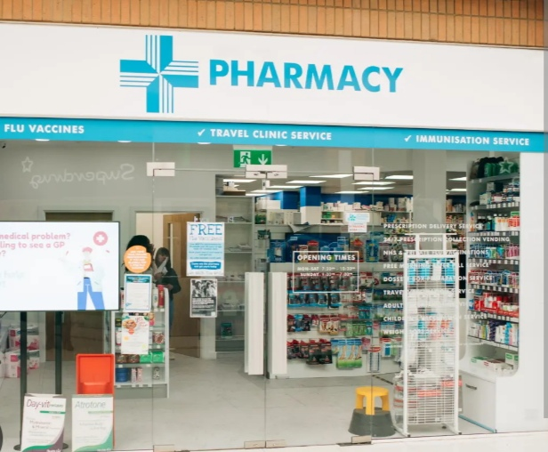
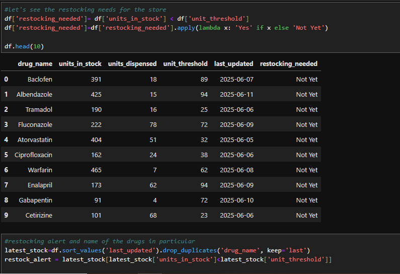
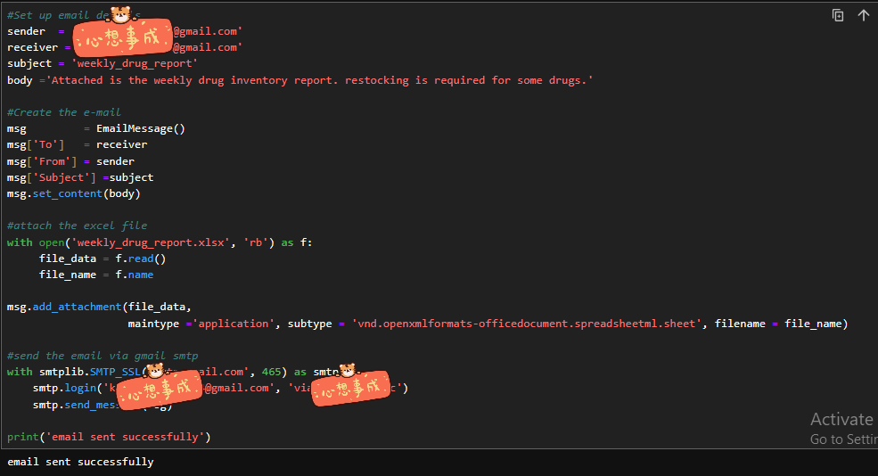
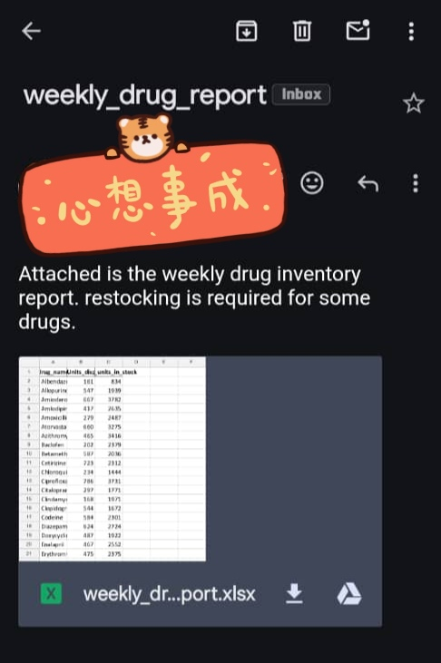

# Automation-in-Pharmacy

There’s a pharmacy in my area that I’m quite familiar with. One day, I stopped by to get something when I overheard a small argument between the staff: “You were supposed to tell me we were out of stock!”  “No, you were!”

That moment sparked an idea 

I asked the owner if I could take a look at just one week’s worth of their inventory data. With Python, I created a:

Weekly Drug Inventory and Report System
to help them:

✅ Track drugs dispensed

✅ Monitor remaining stock

✅ Automatically flag restocking needs

✅ Email reports with restock alerts

 ## Python Skills
 
 - Pandas
 
 - Numpy
 
 - Simple Mail Transfer Protocol Library
 
 - Open Python Excel Library

 ## My Process

  ### Step 1 
Data Cleaning & Structuring: I worked with fields like drug_name, units_in_stock, units_dispensed, unit_threshold, and last_updated.

  ### Step 2
Analysis & Automation: I calculated weekly totals, created a restocking alert column, and built summary reports using pandas.

  ### Step 3  
 Reporting & Alerts: Generated Excel reports with openpyxl, and automated email notifications using smtplib with a Gmail App Password.

  #### A copy of the email received by the manager
  

## Conclusion 
This project is a reminder of how data solutions don't have to be complex to make a real impact, even a simple Python script can solve an everyday problem and prevent costly stockouts in a small business.
